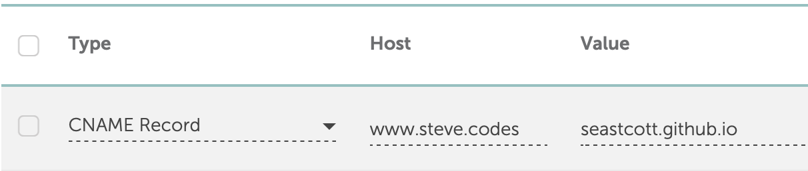

## Decisions, Decisions
When I went to create this blog, I quickly hit decision paralysis. Should I use a CMS? Which one? Strapi? Ghost? Sanity? Should I write the frontend in Next.js, or keep it simple with a static site generator like Hugo or Jekyll? Is WordPress still a thing? Where should I host?

After hours of research, I finally decided on Next.js and Strapi. Over-engineered for the purpose of this blog, but I thought learning this stack would be interesting. That is… until I looked at hosting cost. Hosting through Digital Ocean with the Strapi-recommended CPU and memory was going to be $50/mo, so I scrapped everything and went with basic Hugo and GitHub Pages. Hugo because I found a theme that I liked, GitHub Pages because it’s free.

## Hugo
Hugo is framework for static site generation, meaning the entirety of my blog will be written in markdown and checked into [GitHub](https://github.com/seastco/seastco.github.io). I found the [Cactus theme](https://www.takuzen.me/hugo-theme-cactus/) which is exactly what I was looking for. Simple, minimal. No bells, no whistles. My only gripe was the literal cactus logo and the light green color, so I changed those.

## GitHub Pages
I had a hiccup with linking my custom domain _steve_._codes_ to GitHub Pages _seastco.github_._io_. In my domain’s DNS settings, I added a CNAME record with host _www.steve_._codes_ and value _seastco.github_._io_. This did not work as expected. I fundamentally misunderstood the meaning of host and how it is different than domain.

What I learned: host and domain are usually used together in the form _host.domain_._com_, i.e. _steve_._codes_ is the domain and _www_ is the host. _www.steve_._codes_ is technically a valid host, but that would leave us with _www.steve_._codes_._steve_._codes_. With _www.steve_._codes_ set as the CNAME record host, I spent hours wondering why navigating to _www.steve_._codes_ was failing with a DNS error. I threw in the towel thinking it was a caching issue that would eventually resolve on its own (nope). I ran this problem by a friend the next day and fortunately he was able to set me straight.

**Incorrect** (_www.steve_._codes_._steve_._codes_):

**Correct** (_www_._steve_._codes_):

And we’re live! I started wondering, though, how scalable is GitHub Pages? It is free after all. Sure enough, there's a bandwidth [limit](https://docs.github.com/en/pages/getting-started-with-github-pages/about-github-pages#usage-limits) of 100 GB per month and a site size limit of 1 GB. I’ll definitely never exceed these, but it’s worth exploring what my next-best option would be. I’ll look at this more in a future post.
