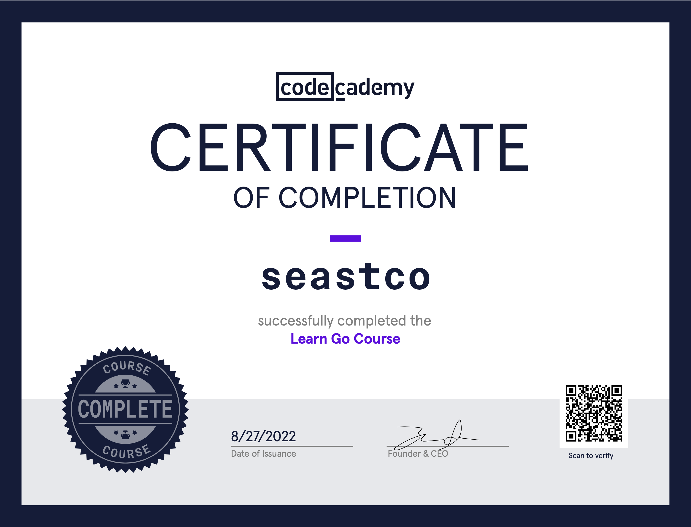

This post was supposed to be about building a barebones Redis prototype in Go. I’ve never written Go before, so I’m not sure why I thought diving head first into a complex project like this would be a good idea. I was making gradual progress, but the constant pausing to look up syntax was getting tiring. I decided to put the project on hold and take the time to learn Go a bit more methodically. 

I’m most proficient in Java. It was widely used at my university, and it’s the only language I’ve ever written professionally. I know enough Python to get stuff done, but I wouldn’t call myself proficient. Anything outside of that I haven’t touched in 5+ years.

I began going through [A Tour of Go](https://go.dev/tour/list), but it felt too bland. I can't help but like gamified tutorials with badges, streaks, and progress bars. These things keep me motiviated and give me a better sense of achievement. Remembering my early programming days, I checked to see if [codecademy](https://www.codecademy.com) was still a thing. Not only is it still a thing, it is seemingly more popular than ever. The course catalog has grown to have pretty much anything you could ask for. I jumped into the two Go courses and was able to finish in a weekend.

Overall, I’m loving Go. I’m still a noob so I don’t have a novel take to share, but I just love all the little things they get right. Goroutines, defer, failing to compile for unused imports and variables, support for multiple return types, type inference. All great features. Side note: is there a mainstream language that is not enjoyable to learn? TypeScript, Elixir, Rust, Kotlin, Julia, Swift, etc. are all so refined these days. I’m sure they’re all great; I’ve never been one to partake in language wars.

Now that I'm done with codecademy, back to the Redis prototype I go (pun intended).

