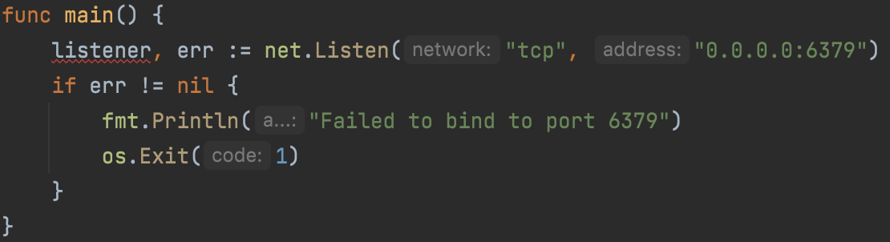
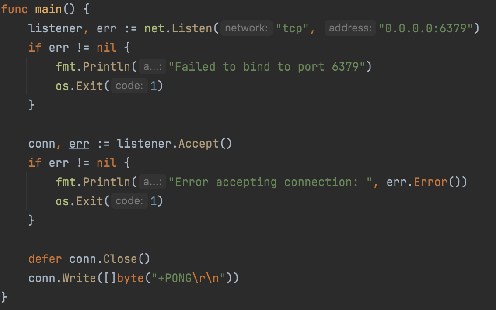
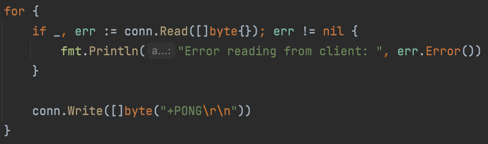
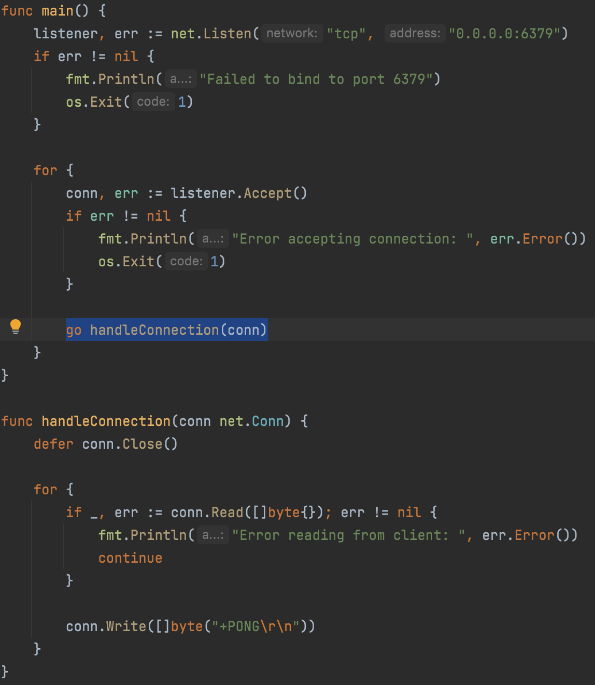

I have a great deal of respect for anyone who’s built something novel. Whether it’s a programming language, database, or 
web framework, it’s such an amazing feat. I’m five years into my career and I personally wouldn’t know where to start 
with any of these. I wish there was a clear roadmap that outlined "do this and you’ll be good enough to build something 
like Redis." I think the roadmap is to just keep coding? That’s until I stumbled across CodeCrafters, a Y 
Combinator-backed startup trying to teach engineers how to write complex software.

*Practice Writing Complex Software. Recreate Redis, Git, Docker - with your own hands. Gain expert-level confidence by 
taking action and diving deep, learning from the world’s best.* Exactly what I’ve been looking for. I signed up and 
dived immediately into the Redis tutorial.

Each stage in the tutorial has an explanation, solution, and sometimes an official source code walkthrough. I’ve 
provided a summary of each stage below, annotated with some of my thoughts. 

## 1. Bind to a port
First, start a TCP server on port 6379, the default port that Redis uses. This does not compile (yet) because listener 
is an unused variable (+1 for cool Go features).

## 2. Respond to PING
Next, respond to the [PING](https://redis.io/commands/ping/) command. Per the tutorial, hardcode the response and assume 
the client is sending "PING".

Redis clients & servers speak using RESP (REdis Serialization Protocol), so we need to encode the "PONG" response as a 
[RESP Simple String](https://redis.io/docs/reference/protocol-spec/). For RESP Simple Strings, the first byte of the 
response is "+" and different parts of the protocol are always terminated using "\r\n" (CLRF).

### 3. Respond to multiple PINGs
The solution suggested to simply add a for loop to handle multiple client requests. Technically true, but the 
conn.Read() below is non-blocking and will not wait on client input. So as long as the connection is open, server is 
spamming the client with PONG regardless of what client is sending. I raised with the CodeCrafters team that this 
solution is misleading and they agreed to modify it in a future release.

### 4. Handle concurrent clients
To handle multiple concurrent clients, we wrap listener.Accept() in a for loop and handle each connection using a 
*goroutine*. A *goroutine* is a lightweight thread of execution that executes concurrently with the calling one.

### 5. Implement ECHO, GET, & SET commands
Now that we’re dealing with multiple commands, we have to write a RESP parser to actually understand what clients are
sending our server. In short, this required implementing the [RESP protocol spec](https://redis.io/docs/reference/protocol-spec/). 
Once we’ve parsed out the command and respective args, the business logic is straightforward. A simple Map struct was 
used for GET/SET, and ECHO is just responding with the same content provided in the request. I spent a while trying to 
figure out how to condense this into this blog post, but it’s a loooong spec. The code is available on my 
[GitHub](https://github.com/seastco/redis-go/tree/main/app).