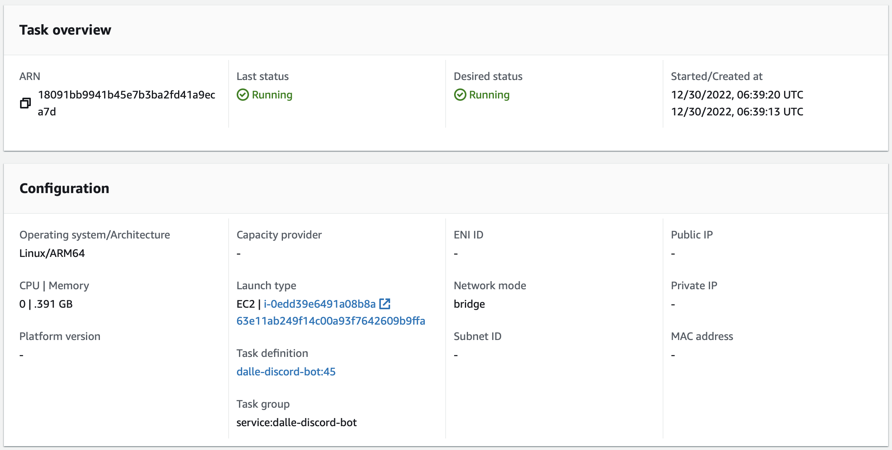
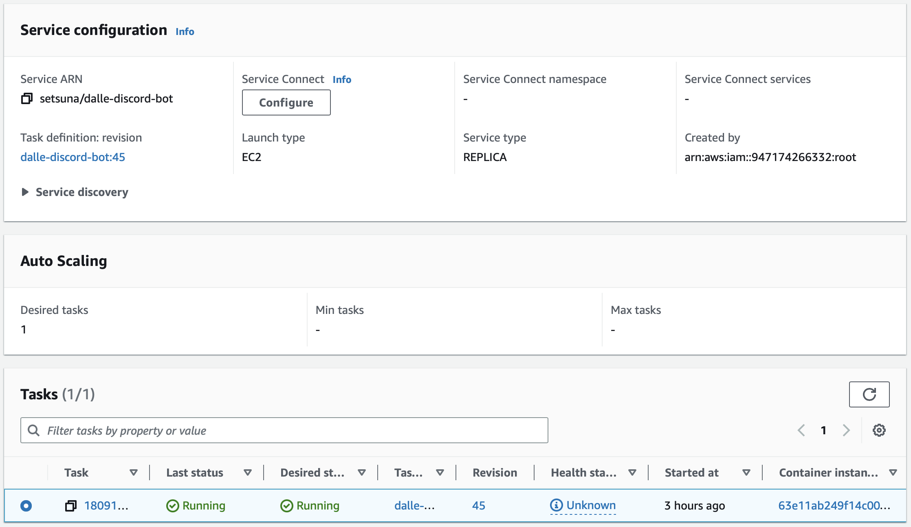
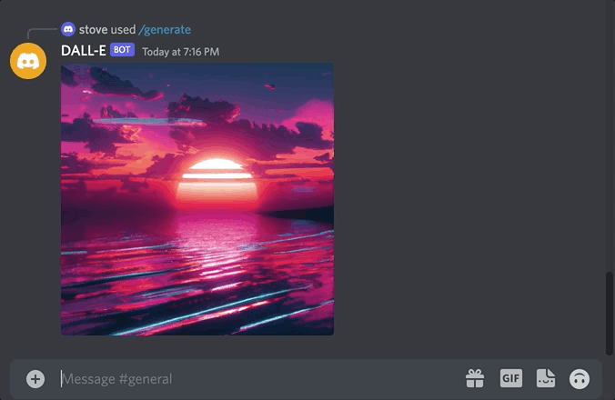

Like most techies, I've found myself fascinated with OpenAI's DALL-E and ChatGPT. And like most techies, I've 
eagerly been telling my (uninterested) non-tech friends about the coming AI revolution. *Sure, man.* They 
couldn't be bothered with creating an OpenAI account and providing their payment information, so I decided to 
bring the magic to them via a Discord bot. Specifically DALL-E, since there's an API readily available to 
interact with it. The use case is simple: create a bot that responds to a */generate <prompt>* command with a 
DALL-E generated image.

## Discord.py
It's been a minute since I've done anything in Python (3.11 is already a thing?!), so I decided to roll with that. 
Fortunately [discord.py](https://discordpy.readthedocs.io/en/stable/) also happens to be one of the most popular 
libraries for creating Discord bots. As you can see, the library is incredibly straightforward to use (the actual 
code is more robust to include retries and error handling, viewable on my [GitHub](https://github.com/seastco/dalle-discord-bot)):

```
@commands.hybrid_command(description="Generate an image.")
@app_commands.describe(prompt="Prompt provided to the image generation model.")
async def generate(self, context: commands.Context, prompt: str):
  await context.defer()
  response = openai.Image.create(prompt=prompt)
  image_url = response["data"][0]["url"]
  await context.send(image_url)
```

## AWS Elastic Container Service (ECS)
For hosting, I went with something I hadn't used before: AWS Elastic Container Service (ECS). Over-engineered for what 
will ultimately be a Python script, but I did it for the sake of learning. With ECS, we define a *task definition* which 
is basically a specification on how to run containers. In here we'll have our container name(s), image(s), CPU/memory 
resources, port mappings, network links, etc. An instance of a task definition is called a *task*. 



We also need to configure something called a *service*, which runs and maintains a specified number of tasks 
simulatenously on EC2 instances. If one of our tasks fails or stops, the service scheduler launches another task to 
replace it. In this case, a single task replica is fine.



And the final product...



## Voucher Service
I started thinking, why not release this to the public? Well, for starters, generating a DALL-E image costs 2 cents a 
pop, and I'm not fronting that cost. I'd have to implement some kind of pay-for-use system. Accepting money for a side 
project, even if it's to break even, is generally prohibited at the company I work for.

...I built it anyway. It just won't be available to the public.

Having purchaseable credits is the simplest approach, i.e. 1 credit == 1 image. The next thing is tying that purchase 
back to a particular Discord user. The best way do this is to have some kind of OAuth login to request client information, 
and then tie that information to a credits purchase. I went barebones and decided to generate a voucher ID for every 
purchase, and then make the user responsible for redeeming that voucher by passing the ID into a Discord command. 
Admittedly not very user friendly, but remember this won't actually have any users.


So to break this down: upon purchase, we store a row containing just the voucher ID and number of credits. Upon redemption, 
we update the row to include the user. Every time an image is created, we decrement the credits column by 1. All of this 
logic is part of a separate *voucher-service* container running as a Flask application on the same EC2 instance as the bot. 

## SQLite
Vouchers are stored in SQLite and the SQLite file is backed by an EBS volume attached to the EC2 instance. Now I didn't do 
extensive research, so I have no clue how this would handle decrementing hundreds or thousands of credits per second. 
Probably woudn't be my first choice for production. I initially wanted to go with an AWS-managed database like RDS, but it 
was too pricey for the scope of this project.

## Fin
And that's that! This started off as a simple Python script running on my machine, and turned into me dabbling with ECS, 
EC2, Flask, and SQLite. Back to my holiday break.

Until next time.

